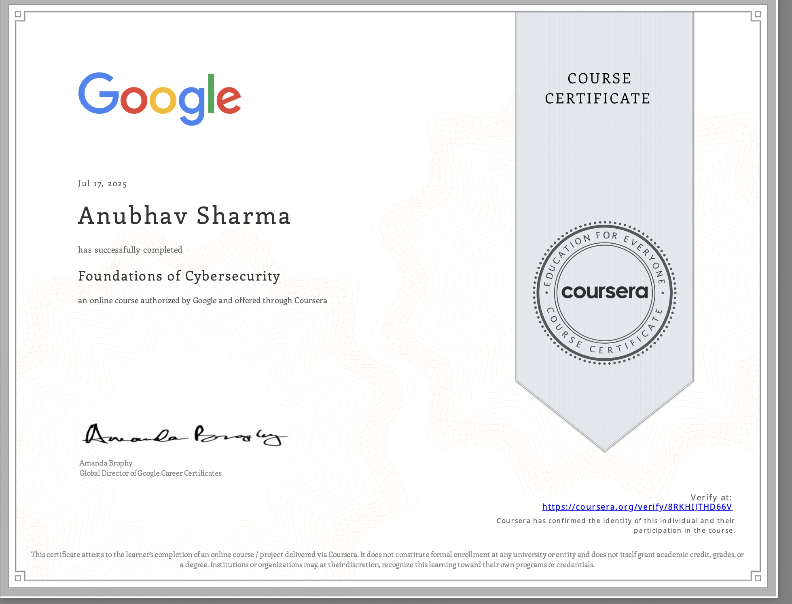

# Module 1: Foundations of Cybersecurity

## 🏆 Certificate Earned

This module introduced the fundamental concepts of cybersecurity, including the history of the field and the core principles used to protect information.

---

## 🧠 Key Learning Objectives

### 1. The History of Malware
I explored some of the most influential historical security events that shaped the modern cybersecurity landscape:

*   **Morris Worm (1988):** One of the first worms to spread via the Internet. It was meant to gauge the size of the Internet but ended up causing significant slowdowns due to a programming error.
*   **Brain Virus (1986):** Considered the first IBM PC-compatible virus. It was created by two brothers in Pakistan to protect their medical software from piracy.
*   **ILOVEYOU Virus (2000):** A devastating worm that spread via email, disguised as a love letter. It infected millions of computers worldwide and highlighted the dangers of social engineering.

### 2. The CIA Triad
The cornerstone of cybersecurity. I learned how to apply these three pillars to protect data:

*   **Confidentiality:** Ensuring that sensitive information is accessed only by authorized individuals. (e.g., Encryption, Access Control).
*   **Integrity:** Maintaining the accuracy and consistency of data over its entire life cycle. (e.g., Hashing, Digital Signatures).
*   **Availability:** Ensuring that information and resources are accessible to authorized users when needed. (e.g., Backups, DDoS Protection).

---

## 📂 Contents
- [Notes](./notes.md) - *Detailed study notes*
- [Assignments](./assignments/) - *Completed course labs and projects*
- [Assets](./assets/) - *Certificates and screenshots*
